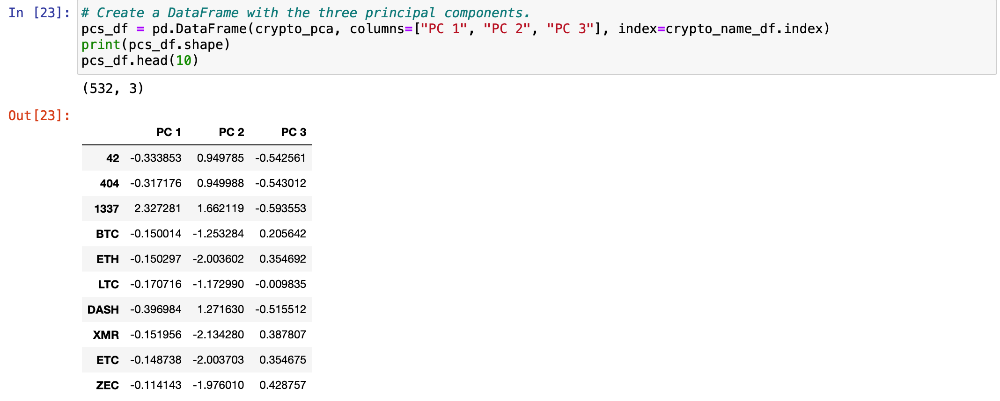
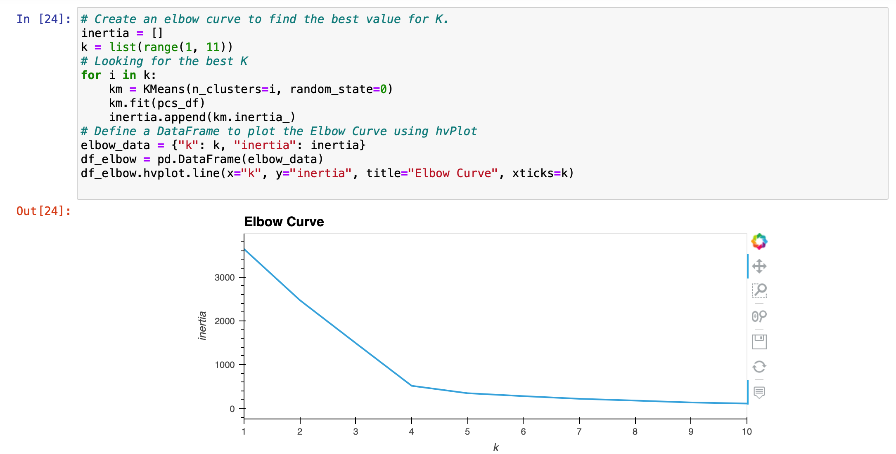
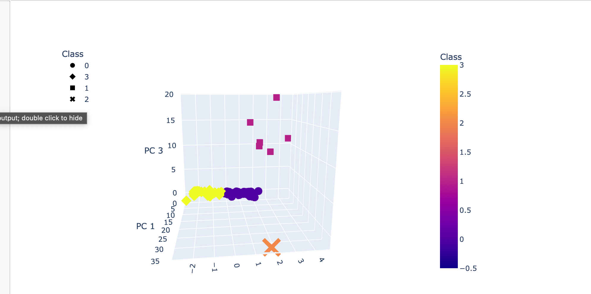
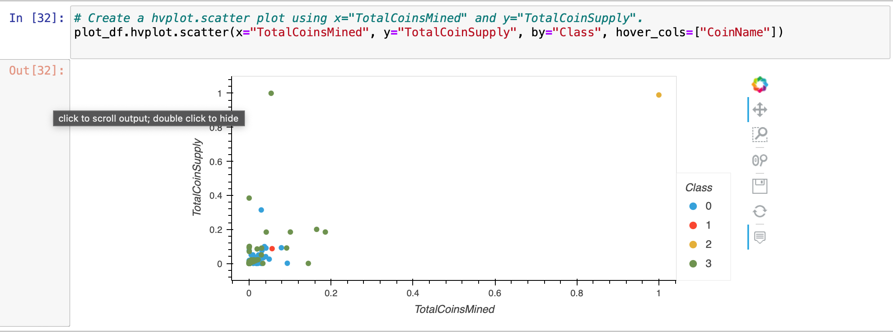

## Cryptocurrencies

##Overview:
The purpose of this project was to use unsupervised machine learning to cryptocurrencies dataset. The tools used were Python,Sklearn, pandas, hvplot libraries and  Jupyter Notebook. The dataset used was crypto_data.csv. Unsupervised machine learning was used as there was no target output but rather to explore trends, patterns and clusters to assist one to make a well-informed decision as to which crypto investments to undertake.

The methods below were used for the analysis:

* preprocessing the database,
* Applying Principal Component Analysis to reduce model features,
* Applying K-Means for clusters,
* 2D and 3D scatter plots visualizations.

## Results:

* Preprocessing techniques were applied to transform and dataset and make it ready for the machine learning model.

* Principal Component Analysis was used to reduce the dataset from 98 features to 3 features. This was after the dataset has been preprocessed and standardized.

* The elbow curve was was used to determine the possible number of clusters for the machine learning model.

* Applying a cluster number of 4 and visualizing using the 3D scatterplot brought our clusters to live with a better representation.

* Lastly, a 2D scatter was also reviewed to explor the clustering with a different visualization.

## Summary
To sum it up, the study using unsupervised machine learning was successful in grouping the cryptocurrencies analyzed into 4 clusters with reference to the total_coins_mined and total_coin_supply.
